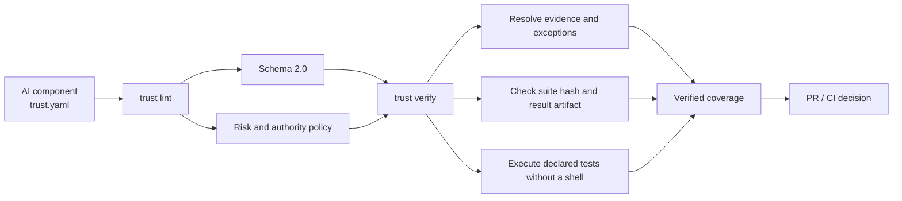

<div align="center">

# T.R.U.S.T.

### Prove your AI controls in CI.

**Traceability · Resilience · Utility · Scope · Testability**

**CI-enforced assurance for AI components.**

</div>

---

T.R.U.S.T. turns AI safety and governance claims into executable repository
checks.

Your pull request says:

> High-risk agent actions require confirmation.

T.R.U.S.T. checks that:

```text
✓ the confirmation implementation exists
✓ tests exercise it
✓ the evidence hash is current
✓ the declared metric matches the test result
✓ the exception has not expired
```

If the evidence stops matching the claim, the PR fails.

**T.R.U.S.T. is policy-as-code for AI engineering evidence.** It gives each AI
component a versioned contract, resolves the evidence behind every enforced
control, runs the declared evaluation suite, and returns a CI decision.

[Quick start](#quick-start) ·
[What the gate checks](#what-the-gate-checks) ·
[Existing repositories](#using-trust-in-an-existing-repository) ·
[Why T.R.U.S.T.?](#why-trust) ·
[Principles](#the-five-principles) ·
[Assurance pipeline](#the-assurance-pipeline) ·
[Manifest](#the-component-contract) ·
[Evidence](#executable-evidence) ·
[Examples](#reference-implementations) ·
[Roadmap](ROADMAP.md)

## Quick start

Run the complete reference gate locally in about two minutes:

```bash
git clone https://github.com/NicolasYusim/TRUST-AI-Engineering.git
cd TRUST-AI-Engineering
./trust check
```

The CLI has no third-party runtime dependency. Normative `.yaml` files use the
JSON-compatible subset of YAML, and the reference CLI uses the Python standard
library.

A successful run reports:

```text
OK: 8 manifests, evidence, 1 evaluation command(s), registry, docs, links, and coverage
```

For a more focused check:

```bash
# Validate declarations and risk policy
./trust lint

# Resolve evidence and run declared evaluation suites
./trust verify

# Render verified control coverage
./trust coverage
```

The offline reference and mutation tests run with:

```bash
python3 -m unittest discover -s tests -v
```

Current repository verification: 8 manifests and 54 tests. The reference
component evidence basis remains `measured` in this repository on `2026-07-27`.

### Using T.R.U.S.T. in an existing repository

Install the package from a T.R.U.S.T. checkout, then run the CLI from your
project root:

```bash
# From the T.R.U.S.T. checkout until the package is published to PyPI
pipx install .

cd my-project
trust init
trust add src/agent/
trust check
```

`trust init` copies the versioned schema and policy into `.trust/`. `trust add`
detects Python source and matching tests, then creates a reviewable draft without
claiming that unsupported controls are enforced. `trust check` reports failures
by component and tells you whether to add evidence, justify a permitted N/A, or
link an approved exception.

Publishing `pipx install trust-ai` to PyPI remains in the
[public roadmap](ROADMAP.md#existing-repository-bootstrap--in-progress).

## What the gate checks

T.R.U.S.T. rejects an assurance claim when:

- referenced implementation, test, or operational evidence is missing;
- an evaluation suite changed without a matching evidence hash;
- a declared metric differs from the committed result artifact;
- the successful test run does not report the required test IDs;
- risk or authority policy requires a control that is not enforced; or
- a control exception is missing, mis-scoped, unapproved, or expired.

The gate proves that repository evidence supports the declared control. It does
not turn a passing test fixture into a claim about production safety or
compliance.

## Why T.R.U.S.T.?

Documentation can claim that a component has traceability, bounded authority, or
an evaluation gate. A checkbox cannot establish whether the referenced artifact
exists, the test suite changed, the metric came from those tests, or an exception
is still valid.

T.R.U.S.T. separates three layers:

| Layer | Question | Repository mechanism |
|---|---|---|
| Declaration | What does this component claim? | `components/*/trust.yaml` |
| Policy | What must this risk and authority level enforce? | `policies/risk-tiers.yaml` |
| Verification | Does the evidence resolve and execute? | `trust verify` |

The result is a reviewable chain from principle to control, from control to
artifact, and from metric to the tests that produced it.

## The assurance pipeline



`trust lint` checks what is declared. `trust verify` checks whether the
declaration is supported by current repository evidence. Coverage is generated
only after verification succeeds.

## The five principles

The canonical machine-readable source is
[`framework/principles.yaml`](framework/principles.yaml). Repository checks keep
this README, the [reference card](PRINCIPLES.md), deep dives, and review
checklists synchronized.

### T1 — Traceability & Attribution

> Significant AI results are linked to the versions of their instructions and models, the relevant inputs and sources, and the tool calls that produced them. Traceability supports attribution, audit, and replay; it does not prove truth or guarantee identical reproduction.

**Review question:** Can we establish what evidence, configuration, and actions produced this result?

### R — Resilience & Ownership

> Every AI dependency has explicit failure semantics, bounded recovery behavior, an observable service objective, and a named owner. The system fails closed or degrades deliberately according to consequence.

**Review question:** How does this component fail or degrade, and who owns the outcome?

### U — Utility & Bounds

> Every AI call has an expected user or business benefit and explicit cost, latency, and resource bounds. Choose the lowest-cost path that meets measured quality and safety requirements.

**Review question:** Is this the cheapest and fastest path that meets the required quality and safety?

### S — Scope & Structure

> Model output and tool requests are untrusted. Authoritative state, authorization, and side effects remain under a deterministic control plane that enforces schemas, least privilege, and action boundaries before execution.

**Review question:** What may the model decide or do, and which code-enforced controls apply before execution?

### T2 — Testability & Oversight

> AI changes are evaluated on versioned evidence with metrics and oversight proportional to consequence. Uncertainty is calibrated independently; high-risk actions require abstention, review, or another effective control.

**Review question:** What evidence shows this change meets its quality and risk thresholds?

Traceability makes a result investigable, not necessarily true. Structured output
makes a value parseable, not necessarily correct. Human review is one possible
control, not a substitute for calibrated evaluation or safe system design.

## The component contract

Every AI-enabled component owns a `trust.yaml` conforming to
[`schema/trust.schema.json`](schema/trust.schema.json).

Schema 2.0 records:

- reviewed consequence, likelihood, exposure, detectability, and rationale;
- implementation and test artifacts;
- data classification and evidence-labelled operational numbers;
- effective authority, tools, resources, network scope, and effect bounds;
- traceability, recovery, utility, evaluation, security, and operations controls;
- exceptions and their independent approval.

A shortened excerpt:

```json
{
  "schema_version": "2.0",
  "component": "support-answer-generator",
  "owner": "support-platform",
  "risk": {
    "consequence_tier": "medium",
    "likelihood": "possible",
    "exposure": "public",
    "detectability": "medium",
    "reviewed_by": "trust-maintainers",
    "reviewed_at": "2026-07-27"
  },
  "authority": {
    "mode": "read_only",
    "allowed_tools": ["knowledge_search"],
    "allowed_resources": ["support-kb:published"]
  },
  "traceability": {
    "source_provenance": {
      "status": "enforced",
      "evidence": [
        "examples/support-answer-generator/correct.py",
        "tests/test_examples.py"
      ]
    }
  }
}
```

See the complete
[`support-answer-generator/trust.yaml`](components/support-answer-generator/trust.yaml).

## Explicit control status

Every reviewable control has exactly one state:

| Status | Meaning | Required proof |
|---|---|---|
| `enforced` | The repository claims the control exists | Resolvable and verifiable evidence |
| `not_applicable` | The control does not apply in this scope | Concrete rationale; policy must permit N/A |
| `unsupported` | A generated draft exposes an evidence decision that is not complete | Add evidence, use a permitted N/A, or link an approved exception; `trust check` fails |
| `exception` | The control is temporarily unmet | Linked, approved, independently reviewed, unexpired exception |

Generated manifests use `lifecycle: draft`; active manifests continue to use the
same enforced evidence and blocking-metric requirements. This avoids treating an
empty field as compliance or pretending that an undeployed example has
production controls.

Exception records conform to
[`schema/exception.schema.json`](schema/exception.schema.json) and are verified
for scope, evidence, independent approval, and expiry.

## Risk determines rigor

T.R.U.S.T. uses consequence and effective authority instead of
MVP/PMF/Enterprise labels.

| Dimension | Values |
|---|---|
| Consequence | `low`, `medium`, `high`, `critical` |
| Authority | `advisory`, `read_only`, `reversible_write`, `irreversible_action` |

The manifest also records likelihood, exposure, detectability, classification
rationale, reviewer, and review date. Effective authority includes transitive
tool capabilities—not merely the label attached to an agent.

The policy in [`policies/risk-tiers.yaml`](policies/risk-tiers.yaml) increases
required controls with consequence and authority:

- components with tools must log tool events;
- high-consequence components require source provenance, slice analysis,
  oversight, sandboxing, audit, alert signals, and declared slices;
- reversible writes require action-bound confirmation, payload-bound
  idempotency, and transaction or compensation evidence;
- critical actions require stricter tenant isolation, independent approval,
  additional slices, and shorter exception lifetimes.

See [`docs/risk-tiers.md`](docs/risk-tiers.md).

## Executable evidence

An evaluation claim is not accepted merely because a result file exists.

Each suite binds:

- a repository path and SHA-256 hash;
- a shell-free command array;
- declared test IDs;
- a named population and evaluation date;
- a result artifact.

Each blocking metric binds:

- `result_key` — where the observed value lives in the result artifact;
- `test_ids` — which tests produced the result;
- `comparator`, `threshold`, `observed`, and `unit`;
- evidence basis and rationale.

During `trust verify`, the framework checks that:

1. the suite hash still matches;
2. the evidence artifact contains the declared result key;
3. the observed value matches the artifact;
4. the comparator passes;
5. metric test IDs match the artifact mapping;
6. those tests belong to the suite;
7. the successful test run actually reports every required test ID.

The implementation lives in
[`trustlib/framework.py`](trustlib/framework.py).

## Security, privacy, and compliance overlay

The overlay applies across all five principles and at every product stage:

- data classification, retention, minimization, and PII policy;
- tenant isolation, authentication, authorization, and least privilege;
- tool, resource, network, and side-effect boundaries;
- prompt injection and untrusted-content threat scenarios;
- secrets, dependency/model provenance, and supply-chain controls;
- sandboxing, deadlines, idempotency, confirmation, and rollback;
- privacy-aware audit, alerts, incident ownership, and scoped exceptions.

Injection detectors and string filters are signals, not trust boundaries.
Capability restriction and deterministic authorization remain primary controls.

Start with:

- [`docs/security-privacy-overlay.md`](docs/security-privacy-overlay.md)
- [`docs/threat-models/reference-components.md`](docs/threat-models/reference-components.md)

## High-consequence action control

The support-ticket router demonstrates controls that are often described but not
bound to the exact action being executed:

- confirmation is tied to authenticated identity, tenant, and canonical plan hash;
- idempotency keys are bound to tenant and plan payload;
- tool, transition, resource, and per-tool effect limits are checked first;
- in-memory effects roll back when an adapter fails;
- blocked, conflicting, failed, and applied plans emit audit events and alert
  signals.

Reference:
[`sandbox_correct.py`](examples/state-structure/sandbox_correct.py).

The example proves behavior for the committed in-memory fixture. Production
adapters still need independent evidence for identity, storage, transactions,
notifications, and monitoring.

## Evidence-labelled numbers

Operational thresholds, timeouts, rates, budgets, sample sizes, and cost claims
declare one evidence basis:

| Basis | Meaning |
|---|---|
| `measured` | Reproduced on a named population with dated evidence |
| `illustrative` | Demonstrates mechanics; not a recommendation |
| `recommended_default` | Starting value with owner and review condition |
| `externally_sourced` | Taken from a dated primary source |

See [`docs/evidence-labels.md`](docs/evidence-labels.md).

## Verified coverage

[`reports/coverage.md`](reports/coverage.md) is generated only after full evidence
verification. It reports resolved control state—not merely the presence of
manifest sections.

Current repository snapshot:

| Measure | Verified result |
|---|---:|
| Components | 8 |
| Components without exceptions | 8 |
| Executable evaluation gates | 8 |
| Open component exceptions | 0 |

Coverage means that repository evidence resolved and the declared suites passed.
It does not prove production effectiveness, safety, fairness, or compliance.

## Reference implementations

Positive examples run offline with deterministic fake clients. Each states what
it proves and what it does not prove.

| Component | Demonstrated control |
|---|---|
| [Support answer generator](examples/support-answer-generator/correct.py) | Approved sources, citation validation, abstention |
| [Document summarizer](examples/traceability/correct.py) | Observable call reconstruction and artifact references |
| [GraphRAG answerer](examples/traceability/graphrag_correct.py) | Traversal provenance and source-node trace |
| [Code generator](examples/resilience/correct.py) | Total deadline, bounded fallback, unsafe-output rejection |
| [FAQ answerer](examples/unit-economics/correct.py) | Scoped caching and bounded routing |
| [Job data extractor](examples/state-structure/correct.py) | Schema, relation, and non-empty evidence validation |
| [Support ticket router](examples/state-structure/sandbox_correct.py) | Bounded authority and side-effect control |
| [Support ticket triage](examples/testability/correct.py) | Versioned baseline/candidate evaluation and abstention |

The paired `violation.py` files are intentionally unsafe teaching examples.

## Reproducible case studies

The repository includes measured executions of committed synthetic fixtures:

- [support-triage candidate gate](case-studies/support-triage.md);
- [FAQ routing call reduction](case-studies/faq-routing.md);
- [agentic control-plane blocking](case-studies/agentic-control.md).

They are real repository executions, not production deployments. Results must not
be generalized beyond their stated population.

No independently reproducible external-project assessment is published yet. The
[external project evidence milestone](ROADMAP.md#external-project-evidence--planned)
requires at least three projects, exact control counts, commit-pinned evidence,
reproducible commands, findings, and explicit limitations. Until that milestone
is met, T.R.U.S.T. does not present its own fixtures as adoption evidence.

## Standards crosswalk

The versioned [crosswalk](docs/crosswalk.md) maps T.R.U.S.T. engineering controls
to themes in:

- NIST AI RMF;
- OWASP Top 10 for LLM and Generative AI Applications;
- Google Secure AI Framework;
- ISO/IEC 42001.

The mapping is informative and non-exhaustive. Passing `trust check` does not
establish certification or regulatory compliance.

## Repository map

```text
framework/       canonical principle definitions
principles/      durable-principle deep dives
code-review/     pull-request review checklists
components/      Schema 2.0 component contracts
schema/          component and exception JSON Schemas
policies/        consequence and authority requirements
trustlib/        lint, policy, evidence, and coverage engine
examples/        executable references and unsafe counterexamples
evals/           versioned evaluation populations
tests/           unit, evidence, mutation, and negative tests
case-studies/    reproducible fixture-based measurements
docs/            overlays, risk model, threat models, practices, crosswalk
registry/        dated provider/model facts
reports/         verified coverage snapshot
exceptions/      scoped control exceptions
ROADMAP.md        adoption milestones and acceptance criteria
```

## What T.R.U.S.T. does not promise

Adopting the framework does not by itself prove that an AI system is:

- correct, safe, secure, private, fair, or fit for a specific domain;
- representative of production populations;
- compliant with a law, contract, or external standard;
- protected by production monitoring merely because an offline example passes.

T.R.U.S.T. makes claims explicit and evidence reviewable. The quality and scope
of that evidence remain engineering and governance responsibilities.

## Contributing

Follow the repository's [contribution and editing rules](CONTRIBUTING.md).

Before opening a pull request:

```bash
./trust check
python3 -m unittest discover -s tests -v
```

Keep the pull request focused on one assurance improvement. Changes to
canonical principles require a recorded decision. Control exceptions require
an owner, independent approver, evidence, expiry, and removal or review plan.

See:

- [`CHANGELOG.md`](CHANGELOG.md)
- [`docs/decisions-and-exceptions.md`](docs/decisions-and-exceptions.md)
- [`docs/practices_2026_Q3.md`](docs/practices_2026_Q3.md)

## License

[MIT](LICENSE)
